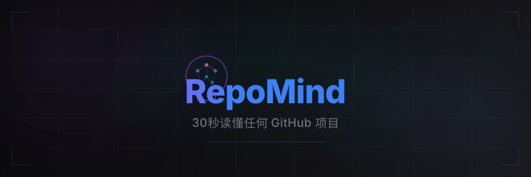

<p align="center">
  
</p>

<p align="center">
  <a href="#"></a>
  
  
  
  
</p>

<p align="center">
  <strong>AI 替你阅读源码。</strong>输入 GitHub 仓库链接，30 秒内获得架构分析、模块文档和智能问答。
</p>

---

## 核心能力

**架构图自动生成** — AI 分析代码结构，自动生成 Mermaid 架构图、模块依赖关系和调用链路。

**RAG 智能问答** — 基于向量检索的项目级问答。问一句"认证逻辑在哪里？"，直接定位代码位置。

**学习路径推荐** — 为复杂项目生成推荐阅读顺序，新人 onboarding 从数天缩短到数小时。

## Demo

<p align="center">
  <em>截图和 GIF 演示待添加 — 运行项目后可自行体验完整流程</em>
</p>

## 快速开始

### Docker Compose（推荐）

```bash
cp backend/.env.example backend/.env
# 编辑 .env 填入 DEEPSEEK_API_KEY

docker compose up
```

访问 http://localhost:5173

### 手动部署

**后端：**

```bash
cd backend
python -m venv .venv && source .venv/bin/activate
pip install -r requirements.txt
cp .env.example .env  # 填入数据库连接和 DeepSeek API Key
uvicorn app.main:app --reload --port 8000
```

**前端：**

```bash
cd frontend
npm install
npm run dev
```

### 使用方式

1. 粘贴一个 GitHub 仓库链接
2. 等待 AI 自动完成分析（约 30 秒）
3. 查看架构图、目录结构、项目概述
4. 使用 RepoChat 向代码库提问

## 技术栈

| 层级 | 技术 |
|------|------|
| 前端 | React 18 · TypeScript · Vite · TailwindCSS · framer-motion · Mermaid |
| 后端 | FastAPI · SQLAlchemy (async) · Alembic · tree-sitter |
| 数据库 | PostgreSQL 16 · pgvector (向量检索) |
| AI | DeepSeek API (LLM 推理 + Embedding) · RAG Pipeline |

## 系统架构

```
┌─────────────────┐     ┌──────────────────┐     ┌──────────────┐
│   React UI      │────▶│   FastAPI         │────▶│  PostgreSQL  │
│   (Vite + TS)   │     │   Backend         │     │  + pgvector  │
└─────────────────┘     └────────┬─────────┘     └──────────────┘
                                 │
                     ┌───────────┼───────────┐
                     │           │           │
               ┌─────▼─────┐ ┌──▼────────┐ ┌▼────────────┐
               │ DeepSeek  │ │tree-sitter│ │  Repo       │
               │ API       │ │ AST       │ │  Scanner    │
               └───────────┘ └───────────┘ └─────────────┘
```

## 项目结构

```
RepoMind/
├── backend/
│   └── app/
│       ├── api/routes.py          # API 端点 (6 个)
│       ├── core/                   # 配置 + 数据库连接
│       ├── models/project.py       # ORM 模型 (Project, File, Chunk)
│       └── services/
│           ├── parser/             # 仓库克隆 + 文件扫描 + 技术栈检测
│           ├── analyzer/           # tree-sitter AST 分析
│           ├── ai/                 # DeepSeek LLM 调用
│           └── rag/                # Embedding + 向量检索 + Q&A
├── frontend/
│   └── src/
│       ├── pages/                  # Home + ProjectDetail
│       ├── components/             # ChatPanel, DirectoryTree, MermaidDiagram
│       └── services/api.ts         # Fetch API 客户端
└── docker-compose.yml
```

## 开发阶段

- [x] Phase 1: 仓库解析 — 克隆、文件扫描、技术栈识别、目录树
- [x] Phase 2: AST 分析 — tree-sitter 多语言函数/类/import 提取
- [x] Phase 3: AI 集成 — DeepSeek API、架构图、README 生成
- [x] Phase 4: RepoChat — Embedding、RAG、项目问答
- [ ] Phase 5: 体验优化 — 交互式知识图谱、学习路径

## License

MIT
