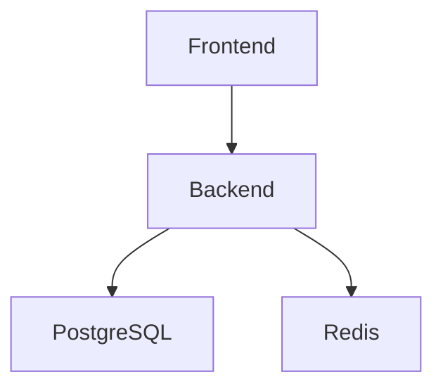

# RepoMind —— AI 仓库理解与架构分析平台

## 一、项目概述

### 1.1 项目名称（推荐）

主推荐名称：

# RepoMind

含义：

* Repo = Repository（代码仓库）
* Mind = 理解、认知、大脑

整体表达：

> “让 AI 理解 GitHub 仓库的大脑系统”

名称特点：

* 国际化
* 简洁
* 容易记忆
* 适合 GitHub
* 适合技术品牌化
* 容易设计 Logo
* 容易注册项目名

---

### 1.2 备用名称（可选）

## 技术风格型

* CodeAtlas
* RepoLens
* NexusCode
* ArchMind
* CodeScope
* RepoBrain
* GraphCode

## 偏 AI 风格

* OmniRepo
* AetherCode
* DeepRepo
* NeuralRepo

## 偏开源社区风格

* OpenArchitect
* RepoGuide
* DevNavigator

---

# 推荐最终名称：

# RepoMind

原因：

* 不局限于“聊天”
* 不局限于“RAG”
* 可扩展性极强
* 未来可以 SaaS 化
* 适合学术竞赛
* 适合论文
* 适合 GitHub 开源品牌

---

# 二、项目背景

## 2.1 行业背景

随着 GitHub、GitLab 等开源社区的快速发展，软件项目规模持续扩大，现代软件系统逐渐呈现：

* 模块复杂化
* 架构微服务化
* 多语言混合化
* 文档缺失化
* 代码历史冗余化

大量开发者在面对陌生项目时，需要花费数小时甚至数天时间：

* 阅读 README
* 分析目录结构
* 理解模块关系
* 查找核心逻辑
* 理解调用链
* 理解数据库结构
* 熟悉 API 路由

而目前现有开发工具主要聚焦于：

* AI 写代码
* AI 自动补全
* AI 代码生成

但对于：

# “已有代码库理解”

这一核心痛点，仍缺少真正成熟的解决方案。

因此，一个能够：

* 自动理解项目结构
* 自动分析代码关系
* 自动生成架构图
* 自动生成技术文档
* 提供 AI 问答能力

的 AI 仓库理解系统，具有极高的工程价值与市场潜力。

---

# 三、项目定位

## 3.1 项目定位

RepoMind 是一个：

# 面向开发者的 AI 仓库理解平台

其核心目标是：

> “让 AI 在数十秒内理解任意 GitHub 项目，并帮助开发者快速上手复杂代码仓库。”

---

## 3.2 核心价值

### 对学生

* 快速学习优秀开源项目
* 降低阅读源码门槛
* 学习系统设计
* 学习数据库架构

### 对开发者

* 降低接手项目成本
* 自动生成文档
* 快速定位核心逻辑
* 降低 onboarding 成本

### 对团队

* 新成员快速熟悉代码
* 自动技术沉淀
* 项目结构可视化
* 架构治理

---

# 四、项目目标

## 4.1 总体目标

构建一个基于：

* AST 静态分析
* RAG 检索增强
* LLM 推理
* 知识图谱
* 多智能体协同

的 AI 仓库分析系统。

---

## 4.2 第一阶段目标（MVP）

实现：

### 输入

用户上传：

* GitHub 仓库链接
* 本地项目文件夹

---

### 输出

自动生成：

* 项目目录树
* 模块说明
* API 路由识别
* 技术栈识别
* Mermaid 架构图
* 自动 README
* 核心文件推荐
* 项目学习路径

---

# 五、核心功能设计

# 5.1 仓库解析模块

## 功能描述

自动扫描项目代码仓库。

支持：

* GitHub 仓库
* GitLab 仓库
* 本地项目
* ZIP 压缩包

---

## 功能内容

### 文件扫描

自动识别：

* Python
* Java
* Go
* C++
* JavaScript
* TypeScript
* Rust
* SQL

---

### 项目结构识别

自动识别：

* src
* api
* controller
* service
* middleware
* config
* database
* model
* router

---

### 技术栈识别

通过：

* package.json
* requirements.txt
* pom.xml
* go.mod
* Cargo.toml

自动识别：

* React
* Vue
* FastAPI
* SpringBoot
* Django
* PostgreSQL
* Redis
* Docker

---

# 5.2 AST 静态分析模块

## 功能描述

通过 AST（抽象语法树）分析项目代码结构。

---

## 核心能力

### 函数分析

识别：

* 函数定义
* 参数
* 返回值
* 调用关系

---

### 类分析

识别：

* 类结构
* 继承关系
* 成员变量
* 方法调用

---

### import 分析

建立：

* 文件依赖图
* 模块依赖图

---

## 技术方案

使用：

* tree-sitter
* Python AST
* clang AST（后期）

---

# 5.3 AI 架构分析模块

## 功能描述

结合 LLM 对整个项目进行架构级分析。

---

## 输出内容

### 项目概述

例如：

“该项目是一个基于 FastAPI + PostgreSQL 的 AI 审查平台。”

---

### 模块职责

自动生成：

* auth 模块负责认证
* db 模块负责数据库访问
* api 模块负责接口暴露

---

### 系统架构分析

自动分析：

* MVC
* 微服务
* 分层架构
* DDD

---

# 5.4 Mermaid 架构图生成模块

## 功能描述

自动生成：

* 系统架构图
* 调用关系图
* 模块依赖图
* 数据流图

---

## 输出形式

Mermaid：



---

# 5.5 RepoChat 项目问答模块

## 功能描述

用户可以直接向项目提问。

---

## 示例

### 用户提问

“认证逻辑在哪里？”

---

### AI 回答

“认证逻辑主要位于：

* middleware/auth.py
* service/jwt_service.py

其中 JWT 校验核心函数为 verify_token()。”

---

# 5.6 自动 README 生成模块

## 功能描述

AI 自动生成项目 README。

---

## 包含内容

* 项目介绍
* 安装方式
* 启动命令
* API 说明
* 技术栈
* 项目结构
* 使用示例

---

# 5.7 项目学习路径生成模块

## 功能描述

帮助开发者快速学习复杂项目。

---

## 示例

```text
Step1：阅读 config/
Step2：阅读 auth/
Step3：阅读 database/
Step4：阅读 router/
```

---

# 5.8 多智能体模块（后期）

## 架构 Agent

负责：

* 分析系统设计
* 分析模块边界

---

## Bug Agent

负责：

* 风险分析
* 潜在 bug 检测

---

## Security Agent

负责：

* SQL 注入检测
* 密钥泄露检测
* 危险 API 检测

---

## Database Agent

负责：

* SQL 分析
* ORM 分析
* 索引分析

---

# 六、系统总体架构

# 6.1 系统架构设计

```text
                用户前端
                    │
                    ▼
            React Web UI
                    │
                    ▼
             FastAPI Backend
                    │
 ┌───────────┬───────────┬───────────┐
 ▼           ▼           ▼
AST分析     RAG检索     AI推理
 │           │           │
 ▼           ▼           ▼
tree-sitter pgvector    DeepSeek API
 │
 ▼
PostgreSQL
```

---

# 七、技术栈设计

# 7.1 后端技术栈

| 技术          | 用途     |
| ----------- | ------ |
| Python      | 核心开发语言 |
| FastAPI     | Web 后端 |
| SQLAlchemy  | ORM    |
| PostgreSQL  | 数据库存储  |
| pgvector    | 向量检索   |
| tree-sitter | AST 分析 |

---

# 7.2 前端技术栈

| 技术           | 用途    |
| ------------ | ----- |
| React        | 前端框架  |
| TailwindCSS  | UI 样式 |
| TypeScript   | 类型支持  |
| Mermaid      | 图生成   |
| Cytoscape.js | 图谱可视化 |

---

# 7.3 AI 技术栈

| 技术           | 用途        |
| ------------ | --------- |
| DeepSeek API | 大模型推理     |
| BGE-M3       | embedding |
| RAG          | 检索增强      |
| LangChain    | AI 编排（后期） |

---

# 八、数据库设计

# 8.1 projects 表

| 字段         | 类型        | 描述   |
| ---------- | --------- | ---- |
| id         | bigint    | 项目ID |
| name       | varchar   | 项目名称 |
| repo_url   | text      | 仓库地址 |
| created_at | timestamp | 创建时间 |

---

# 8.2 files 表

| 字段         | 类型      | 描述   |
| ---------- | ------- | ---- |
| id         | bigint  | 文件ID |
| project_id | bigint  | 所属项目 |
| path       | text    | 文件路径 |
| language   | varchar | 编程语言 |
| content    | text    | 文件内容 |

---

# 8.3 chunks 表

| 字段        | 类型     | 描述       |
| --------- | ------ | -------- |
| id        | bigint | chunk ID |
| file_id   | bigint | 文件ID     |
| embedding | vector | 向量       |
| content   | text   | chunk内容  |

---

# 九、RAG 系统设计

# 9.1 RAG 流程

```text
用户提问
   ↓
Embedding
   ↓
向量检索
   ↓
召回代码块
   ↓
LLM推理
   ↓
生成回答
```

---

# 十、项目开发阶段规划

# 第一阶段（第1~2周）

## 目标

完成基础仓库解析。

---

## 功能

* GitHub 仓库克隆
* 文件扫描
* 技术栈识别
* 项目目录树

---

## 输出

生成：

* JSON 分析结果
* 基础 Web 页面

---

# 第二阶段（第3~4周）

## 目标

完成 AST 分析。

---

## 功能

* import 关系分析
* 函数分析
* 类分析
* 调用关系分析

---

# 第三阶段（第5~6周）

## 目标

接入 AI。

---

## 功能

* DeepSeek API 接入
* 自动 README
* 模块说明
* 架构分析

---

# 第四阶段（第7~8周）

## 目标

实现 RepoChat。

---

## 功能

* embedding
* RAG
* 项目问答

---

# 第五阶段（第9~10周）

## 目标

优化产品体验。

---

## 功能

* UI 美化
* 架构图优化
* 项目学习路径
* README 优化

---

# 十一、项目亮点

# 11.1 技术亮点

* AST + RAG 混合分析
* AI 架构理解
* 项目知识图谱
* 自动架构图生成
* 多语言仓库支持

---

# 11.2 产品亮点

* 极低使用门槛
* 可视化强
* 适合教学
* 适合开源社区
* 适合企业 onboarding

---

# 11.3 创新点

## 创新点1

代码仓库智能学习路径生成。

---

## 创新点2

基于 AST 的结构化仓库理解。

---

## 创新点3

AI 自动生成系统架构图。

---

## 创新点4

多智能体协同代码分析。

---

# 十二、项目应用场景

## 场景1：开源学习

帮助学生快速学习大型项目。

---

## 场景2：企业 onboarding

帮助新人快速熟悉业务系统。

---

## 场景3：技术文档生成

自动生成开发文档。

---

## 场景4：架构治理

分析模块耦合度与系统复杂度。

---

# 十三、GitHub 开源运营规划

# 13.1 README 设计

README 必须包含：

* GIF 演示
* 架构图
* 一键启动
* 示例项目
* Demo 截图

---

# 13.2 Demo 项目

建议：

直接分析：

* FastAPI
* Vue
* Redis
* SpringBoot

热门项目。

---

# 13.3 宣传路线

## 国内

* B站
* 掘金
* CSDN
* 知乎

---

## 国外

* Hacker News
* Reddit
* X(Twitter)
* Dev.to

---

# 十四、未来扩展方向

## 方向1：IDE 插件

支持：

* VSCode
* JetBrains

---

## 方向2：GitHub PR 分析

自动分析 PR 风险。

---

## 方向3：代码知识图谱

构建大型代码关系网络。

---

## 方向4：企业 SaaS

支持：

* 私有部署
* 团队协同
* AI 审查

---

# 十五、项目风险分析

# 15.1 技术风险

## 风险

大型仓库分析性能不足。

---

## 解决方案

* chunk 分析
* 增量索引
* 缓存机制

---

# 15.2 Token 消耗风险

## 风险

AI API 成本过高。

---

## 解决方案

* AST 预过滤
* 小模型摘要
* 分层推理

---

# 15.3 多语言兼容风险

## 风险

不同语言 AST 差异较大。

---

## 解决方案

优先支持：

* Python
* JavaScript
* TypeScript

逐步扩展。

---

# 十六、项目发展路线

# Version 1.0

基础仓库分析。

---

# Version 2.0

RepoChat。

---

# Version 3.0

多 Agent 分析。

---

# Version 4.0

知识图谱。

---

# Version 5.0

企业级 SaaS 平台。

---

# 十七、最终愿景

RepoMind 的最终目标是：

# “构建面向未来 AI 软件工程时代的代码理解基础设施。”

未来的软件开发，将逐渐从：

* 人类逐文件阅读

转向：

* AI 辅助系统级理解

RepoMind 希望成为：

# “AI 理解代码世界的重要入口。”
